# Single Cell Division Volume Visualization / 单细胞分裂体积可视化

> **Bilingual README — English below, 中文在后**

---

## 🇬🇧 English

### Overview

This project provides a Python-based analysis and visualization pipeline for studying **cell volume changes before and after cell division** across different tissue types (Locule and Connective tissue) and developmental stages. It parses single-cell tracking data from an Excel spreadsheet, computes growth metrics, and generates **14 publication-quality figures** (300 DPI PNG) covering cross-sample comparisons, tissue-type comparisons, growth trajectories, and division-event analysis.

### Data

The input data is in `data/single cell division_volume.xlsx` (sheet: **arrangement**). It contains volume measurements (μm³) at three timepoints for individual cells from three biological samples:

| Sample | Stage | Locule Cells | Connective Tissue Cells | Timepoints |
|--------|-------|-------------|------------------------|------------|
| Sample 03 | Stage 4 | 8 | 2 | 0 h, 12 h, 14 h |
| Sample 02 | Stage 6–6.5 | 5 | 3 | 0 h, 12 h, 14 h |
| Sample 08 | Stage 6.5–7 | 14 | 7 | 0 h, 12 h, 14 h |

The **12 h → 14 h** interval corresponds to the **cell division event**.

### Computed Metrics

| Metric | Description |
|--------|-------------|
| **Growth 0 h → 12 h** | Volume increase during the pre-division growth phase |
| **Change at Division (12 h → 14 h)** | Volume change at the moment of division |
| **Total Growth (0 h → 14 h)** | Overall volume change from baseline to post-division |

### Setup & Installation

**Prerequisites:** Python 3.8+

```bash
# 1. Clone the repository
git clone <repository-url>
cd single_cell_division_volume_visualization

# 2. Create and activate a virtual environment
python -m venv venv
# macOS / Linux
source venv/bin/activate
# Windows
venv\Scripts\activate

# 3. Install dependencies
pip install -r requirements.txt
```

### Running the Script

```bash
python generate_visualizations.py
```

**Output:**
- Console: data summary (cell counts per sample and tissue type)
- `visualization/` directory: 14 PNG figures at 300 DPI

### Output Visualizations

All figures are saved to the `visualization/` folder.

---

#### Figure 01 — Locule Cell Volume Across Samples

Box + strip plots comparing locule cell volumes across the three samples at each timepoint (0 h, 12 h, 14 h). Individual data points are overlaid.

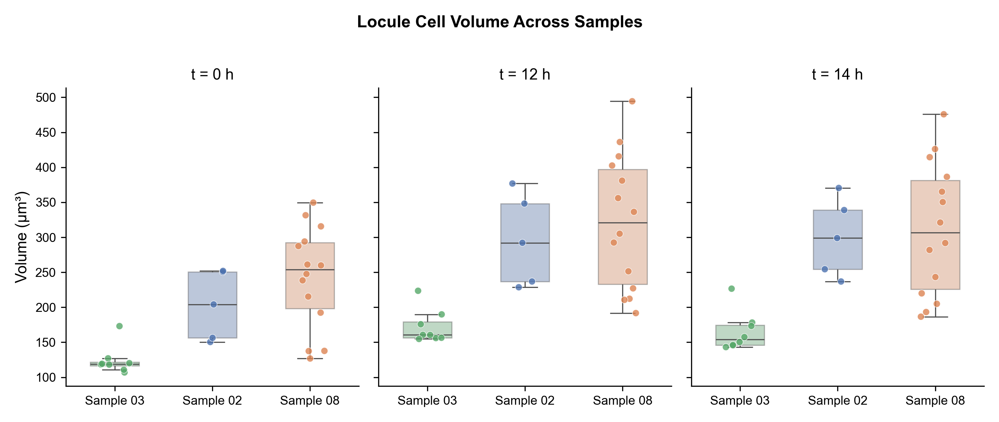

---

#### Figure 02 — Connective Tissue Cell Volume Across Samples

Same layout as Figure 01 but for connective tissue cells, enabling direct comparison of connective tissue volumes across developmental stages.

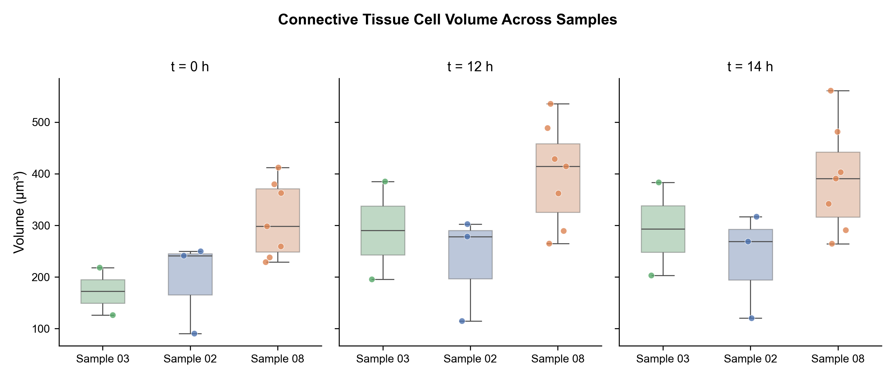

---

#### Figure 03 — Locule vs. Connective Tissue Within Each Sample

Side-by-side comparison of locule and connective tissue volumes within each sample at each timepoint. Reveals tissue-type differences within the same developmental stage.

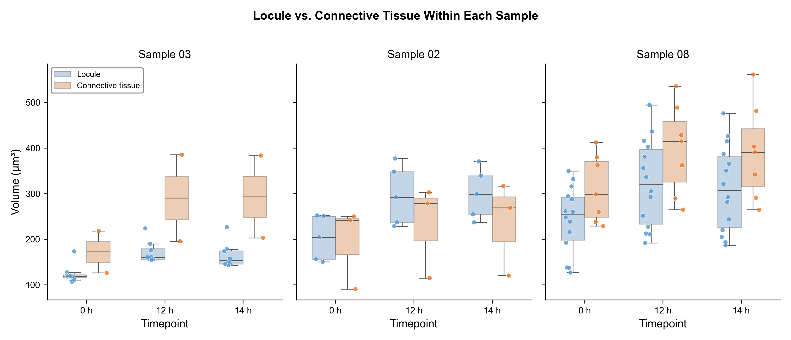

---

#### Figure 04 — Overall Locule vs. Connective Tissue (All Samples Pooled)

Pooled comparison of all locule cells vs. all connective tissue cells across all samples and timepoints.

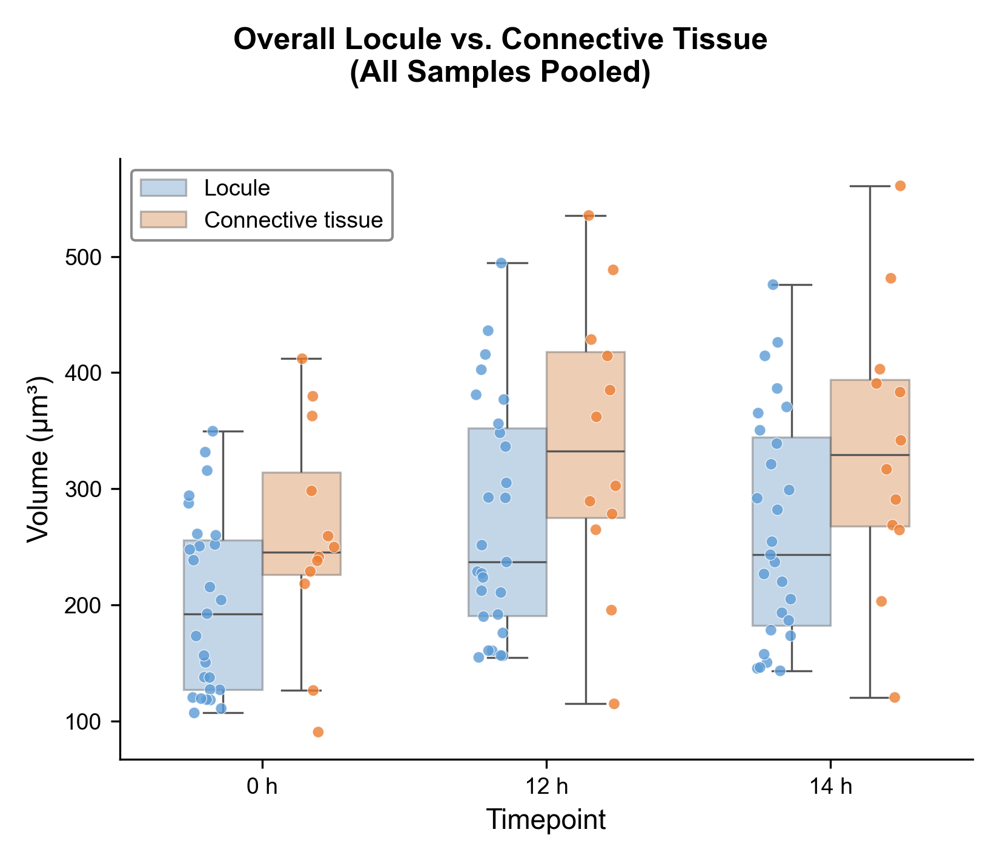

---

#### Figure 05 — Individual Cell Volume Trajectories

Each cell's volume trajectory (0 h → 12 h → 14 h) plotted as a thin line, with the sample mean as a bold line with SEM shading. A **red dashed division line** marks the cell division event between 12 h and 14 h. Panels are organized by sample (columns) and tissue type (rows).

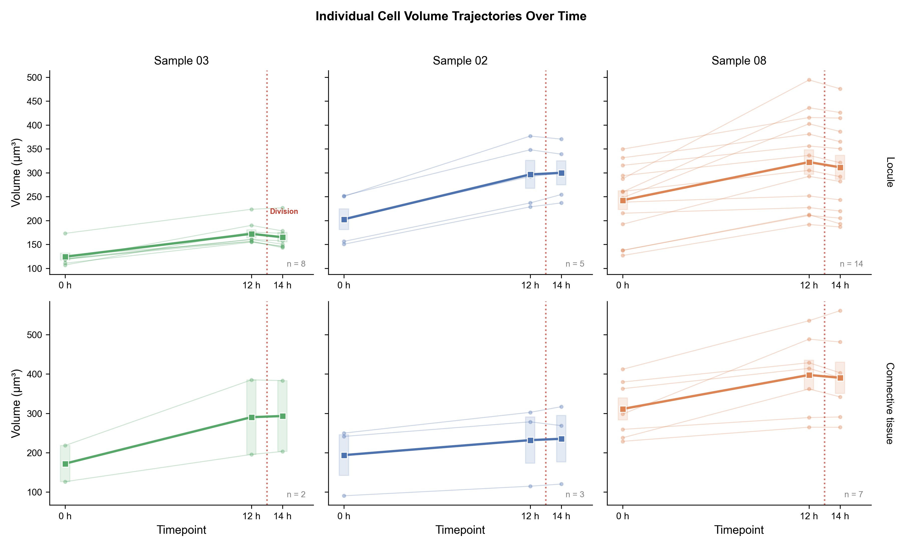

---

#### Figure 06 — Percentage Volume Growth (0 h → 14 h)

Box + strip plots of total percentage growth from 0 h to 14 h. Left panel: grouped by sample and tissue. Right panel: pooled by tissue type.

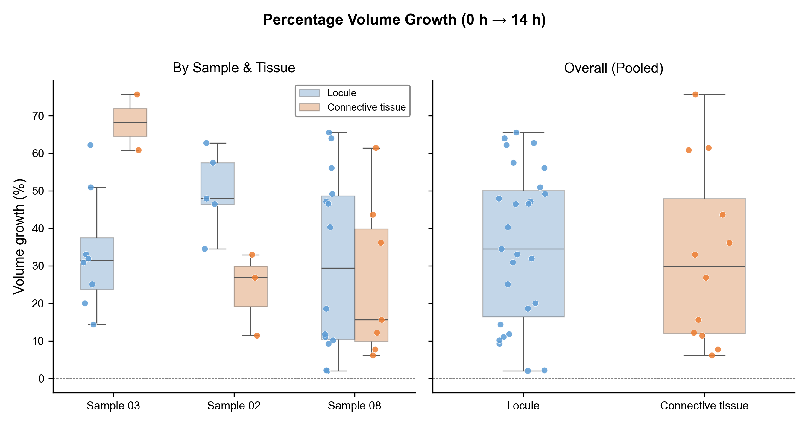

---

#### Figure 07 — Mean Volume Bar Chart with SEM

Grouped bar chart of mean cell volume (± SEM) by sample and tissue type at each timepoint.

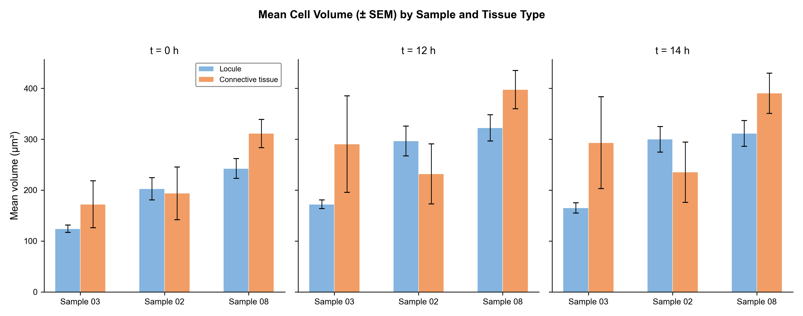

---

#### Figure 08 — Growth Heatmap

Heatmap of mean percentage volume growth for two intervals: 0 h → 12 h (pre-division growth) and 12 h → 14 h (division change), broken down by tissue type and sample.

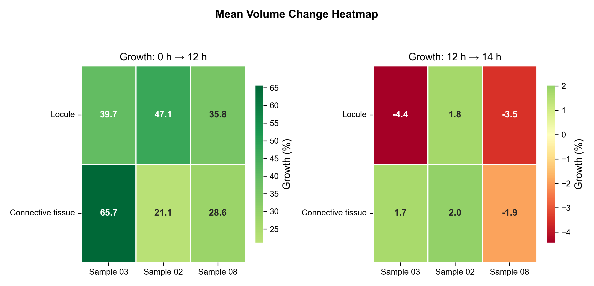

---

#### Figure 09 — Paired Dot Plot (0 h vs. 14 h)

Each cell is shown as a pair of connected dots at 0 h and 14 h, colored by tissue type. Visualizes the direction and magnitude of volume change for every individual cell.

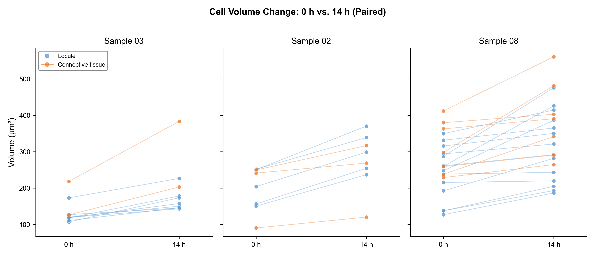

---

#### Figure 10 — Violin Plot: Volume Distribution

Split violin plot showing the full distribution of volumes for locule vs. connective tissue across all samples and timepoints, with individual data points overlaid.

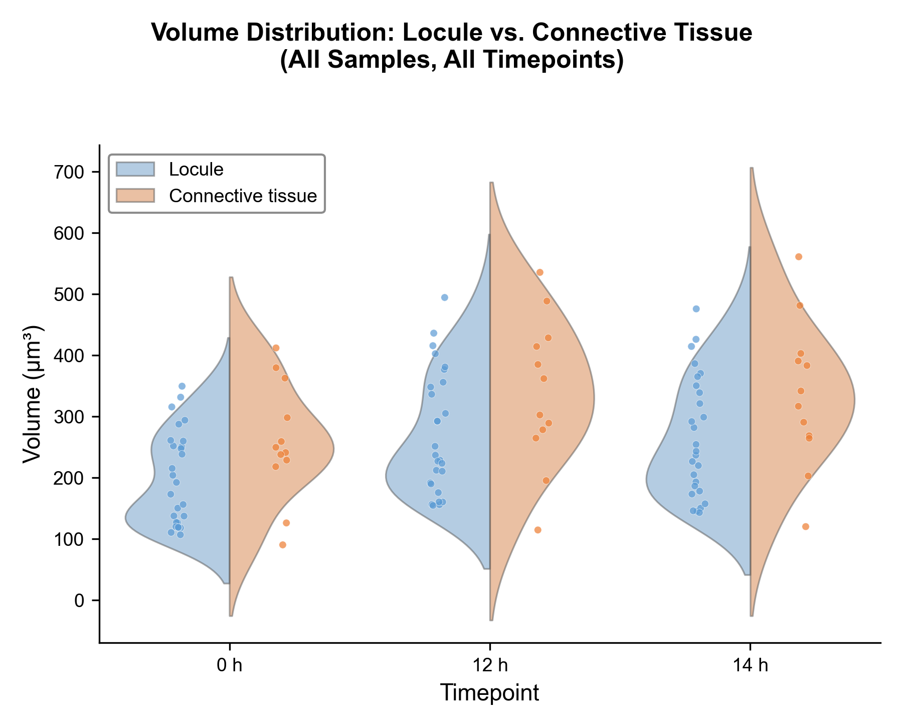

---

#### Figure 11 — Volume Before vs. After Division (Scatter)

Scatter plot of volume at 12 h (before division) vs. volume at 14 h (after division) with a y = x identity line. Points below the line indicate volume loss at division. Two panels: colored by sample and by tissue type.

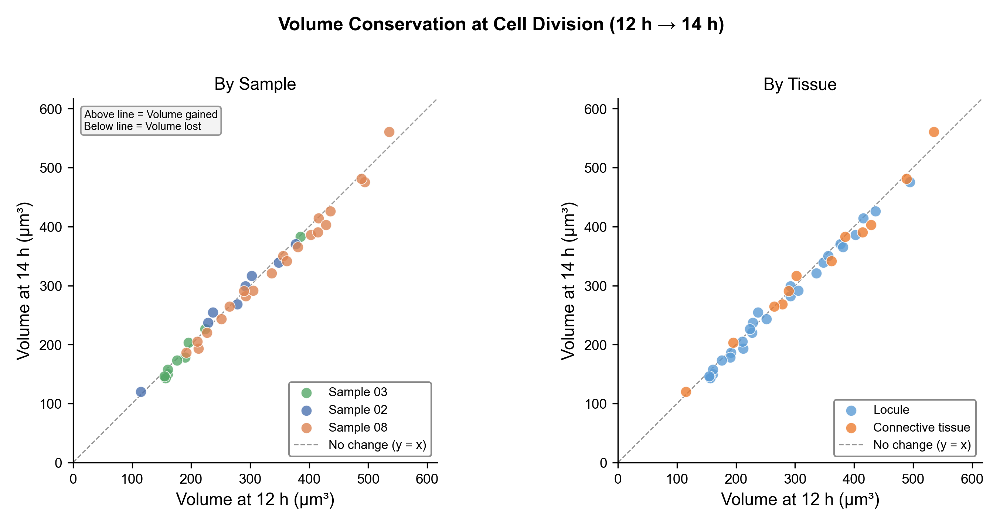

---

#### Figure 12 — Volume Change at Division (12 h → 14 h)

Box + strip plots of percentage volume change during the division event. Three panels: by sample, by tissue, and by sample × tissue.

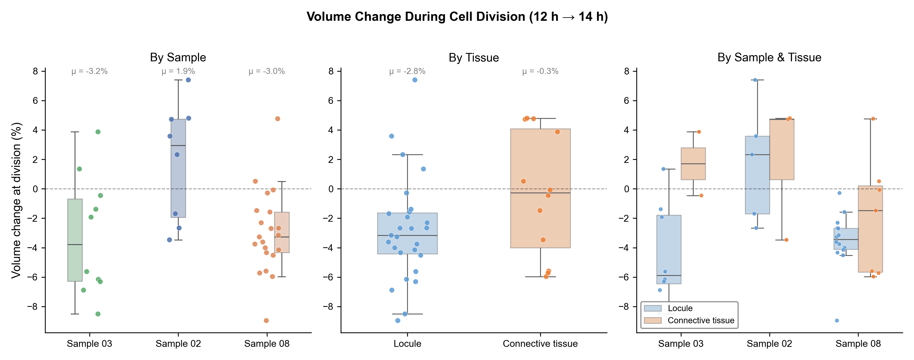

---

#### Figure 13 — Growth Phases Comparison

Grouped bar chart comparing pre-division growth (0 h → 12 h) vs. change at division (12 h → 14 h) with SEM error bars. Left panel: by sample. Right panel: by tissue type.

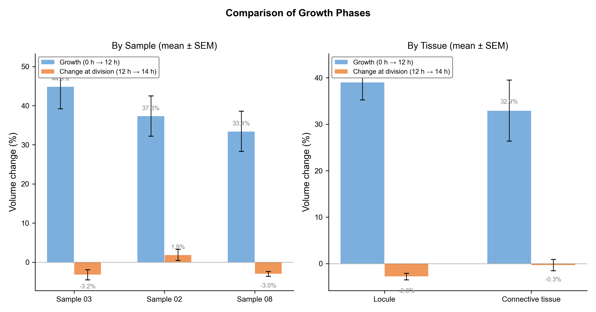

---

#### Figure 14 — Combined Trajectory with Division Marker

All cells from all samples plotted on a single panel with individual traces, per-sample mean trajectories, and a red **"DIVISION"** marker line between the pre- and post-division timepoints.

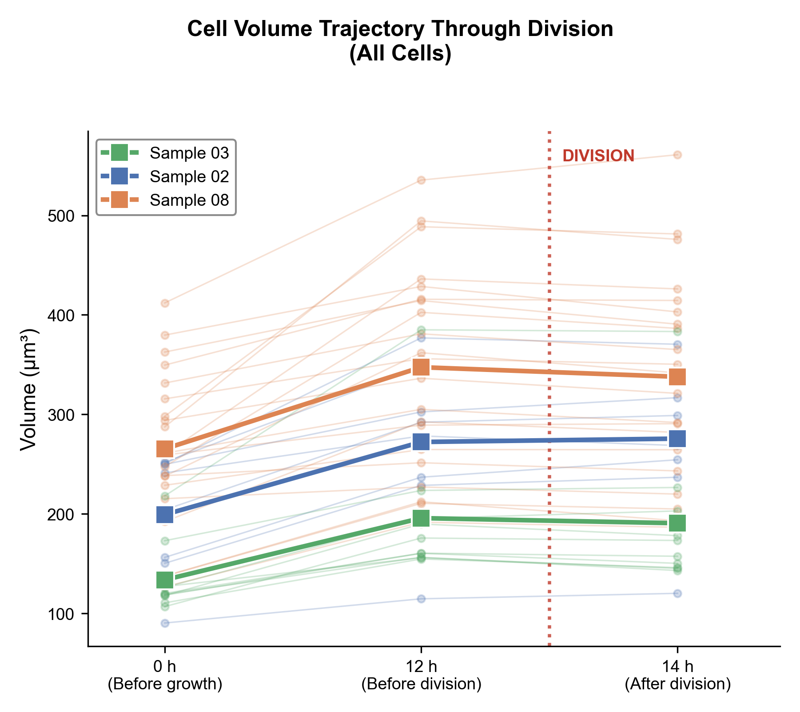

---

### Project Structure

```
single_cell_division_volume_visualization/
├── data/
│   └── single cell division_volume.xlsx   # Raw data (arrangement tab)
├── visualization/                         # Generated figures (14 PNGs, 300 DPI)
│   ├── 01_locule_across_samples.png
│   ├── 02_connective_tissue_across_samples.png
│   ├── 03_locule_vs_connective_within_sample.png
│   ├── 04_overall_locule_vs_connective_tissue.png
│   ├── 05_individual_cell_trajectories.png
│   ├── 06_percent_growth_0h_to_14h.png
│   ├── 07_mean_volume_bars_with_sem.png
│   ├── 08_growth_heatmap.png
│   ├── 09_paired_dotplot_0h_vs_14h.png
│   ├── 10_violin_locule_vs_connective_tissue.png
│   ├── 11_volume_before_vs_after_division_scatter.png
│   ├── 12_volume_change_at_division.png
│   ├── 13_growth_phases_comparison.png
│   └── 14_combined_trajectory_with_division.png
├── OLD/v0/                                # Legacy analysis (archived)
├── generate_visualizations.py             # Main visualization script
├── requirements.txt                       # Python dependencies
└── README.md                             # This file
```

---

## 🇨🇳 中文

### 概述

本项目提供了一套基于 Python 的分析与可视化流程，用于研究不同组织类型（Locule / 胚珠室 和 Connective tissue / 结缔组织）及不同发育阶段下的**细胞分裂前后体积变化**。脚本从 Excel 表格中解析单细胞追踪数据，计算生长指标，并生成 **14 张适合学术发表的高质量图表**（300 DPI PNG）。

### 数据说明

输入数据为 `data/single cell division_volume.xlsx`（工作表：**arrangement**），包含三个生物样本中单个细胞在三个时间点的体积测量值（μm³）：

| 样本 | 发育阶段 | Locule 细胞数 | 结缔组织细胞数 | 时间点 |
|------|---------|-------------|-------------|--------|
| Sample 03 | Stage 4 | 8 | 2 | 0 h, 12 h, 14 h |
| Sample 02 | Stage 6–6.5 | 5 | 3 | 0 h, 12 h, 14 h |
| Sample 08 | Stage 6.5–7 | 14 | 7 | 0 h, 12 h, 14 h |

**12 h → 14 h** 时间段对应**细胞分裂事件**。

### 计算指标

| 指标 | 描述 |
|------|------|
| **生长期增长（0 h → 12 h）** | 分裂前生长阶段的体积增加 |
| **分裂时变化（12 h → 14 h）** | 分裂事件中的体积变化 |
| **总增长（0 h → 14 h）** | 从基线到分裂后的整体体积变化 |

### 安装与配置

**前置条件：** Python 3.8+

```bash
# 1. 克隆仓库
git clone <仓库地址>
cd single_cell_division_volume_visualization

# 2. 创建并激活虚拟环境
python -m venv venv
# macOS / Linux
source venv/bin/activate
# Windows
venv\Scripts\activate

# 3. 安装依赖
pip install -r requirements.txt
```

### 运行脚本

```bash
python generate_visualizations.py
```

**输出：**
- 控制台：数据概要（各样本和组织类型的细胞计数）
- `visualization/` 目录：14 张 PNG 图表（300 DPI）

### 输出可视化图表

所有图表保存在 `visualization/` 文件夹中。

---

#### 图 01 — 不同样本间 Locule 细胞体积比较

箱线图 + 散点图，在每个时间点（0 h、12 h、14 h）比较三个样本的 locule 细胞体积，叠加显示所有数据点。


---

#### 图 02 — 不同样本间结缔组织细胞体积比较

与图 01 相同布局，但展示结缔组织细胞，便于直接比较不同发育阶段的结缔组织体积。


---

#### 图 03 — 同一样本内 Locule 与结缔组织比较

在每个样本内，并排比较 locule 和结缔组织在各时间点的体积差异，揭示同一发育阶段内不同组织类型的差异。


---

#### 图 04 — 总体 Locule 与结缔组织比较（所有样本合并）

将所有样本的 locule 细胞和结缔组织细胞合并后进行比较。


---

#### 图 05 — 单细胞体积轨迹

每个细胞的体积轨迹（0 h → 12 h → 14 h）以细线绘制，样本均值以粗线显示并附带 SEM 阴影区间。**红色虚线**标记 12 h 与 14 h 之间的细胞分裂事件。按样本（列）和组织类型（行）分面展示。


---

#### 图 06 — 百分比体积增长（0 h → 14 h）

箱线图 + 散点图展示 0 h 到 14 h 的总百分比增长。左面板：按样本和组织分组；右面板：按组织类型合并。


---

#### 图 07 — 平均体积柱状图（含 SEM）

分组柱状图展示各样本和组织类型在每个时间点的平均细胞体积（± SEM）。


---

#### 图 08 — 增长热力图

热力图展示两个时间段的平均百分比体积增长：0 h → 12 h（分裂前生长）和 12 h → 14 h（分裂变化），按组织类型和样本分解显示。


---

#### 图 09 — 配对点图（0 h vs. 14 h）

每个细胞以连线的点对形式展示其在 0 h 和 14 h 的体积，按组织类型着色。直观展示每个细胞体积变化的方向和幅度。


---

#### 图 10 — 小提琴图：体积分布

分裂小提琴图展示 locule 和结缔组织在所有样本和时间点的完整体积分布，叠加显示各数据点。


---

#### 图 11 — 分裂前后体积散点图

散点图展示 12 h（分裂前）vs. 14 h（分裂后）的体积，附带 y = x 恒等线。线下方的点表示分裂时体积减少。两个面板分别按样本和组织类型着色。


---

#### 图 12 — 分裂时体积变化（12 h → 14 h）

箱线图 + 散点图展示分裂事件中的百分比体积变化。三个面板：按样本、按组织、按样本 × 组织。


---

#### 图 13 — 生长阶段比较

分组柱状图比较分裂前生长（0 h → 12 h）与分裂时变化（12 h → 14 h），附带 SEM 误差棒。左面板：按样本；右面板：按组织类型。


---

#### 图 14 — 综合轨迹图（含分裂标记）

所有样本的细胞绘制在同一面板上，包含个体轨迹、各样本均值轨迹，以及分裂前后时间点之间的红色 **"DIVISION"** 标记线。


---

### 项目结构

```
single_cell_division_volume_visualization/
├── data/
│   └── single cell division_volume.xlsx   # 原始数据（arrangement 工作表）
├── visualization/                         # 生成的图表（14 张 PNG，300 DPI）
│   ├── 01_locule_across_samples.png
│   ├── 02_connective_tissue_across_samples.png
│   ├── 03_locule_vs_connective_within_sample.png
│   ├── 04_overall_locule_vs_connective_tissue.png
│   ├── 05_individual_cell_trajectories.png
│   ├── 06_percent_growth_0h_to_14h.png
│   ├── 07_mean_volume_bars_with_sem.png
│   ├── 08_growth_heatmap.png
│   ├── 09_paired_dotplot_0h_vs_14h.png
│   ├── 10_violin_locule_vs_connective_tissue.png
│   ├── 11_volume_before_vs_after_division_scatter.png
│   ├── 12_volume_change_at_division.png
│   ├── 13_growth_phases_comparison.png
│   └── 14_combined_trajectory_with_division.png
├── OLD/v0/                                # 旧版分析（已归档）
├── generate_visualizations.py             # 主可视化脚本
├── requirements.txt                       # Python 依赖包
└── README.md                             # 本文件
```

---

## License / 许可证

This project is provided for educational and research purposes.

本项目仅供教育和研究用途。
